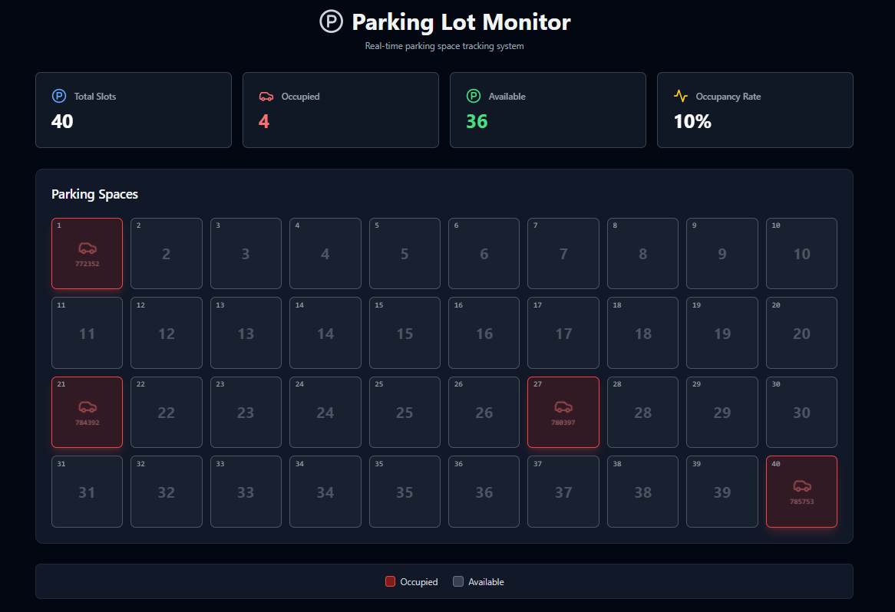

# 🅿️ Smart Parking System – Web Dashboard

A **real-time smart parking management website** that monitors and displays live parking availability using an Arduino-based dual ultrasonic sensor setup.  
The system tracks vehicle entry and exit at parking lot gates and updates a dynamic web dashboard in real time through Supabase.

---

## 🚀 Project Overview

This project provides a **cost-effective and scalable** parking monitoring solution designed for campus environments.  
Instead of using one sensor per slot, it employs **two ultrasonic sensors** — one at the entry and one at the exit — to count vehicles and compute current occupancy.

The website visualizes:
- Total, occupied, and available parking slots  
- Real-time occupancy rate (%)  
- Color-coded indicators for status (🟩 Available / 🟧 Limited / 🟥 Full)  

The frontend is built with **React + Vite + Tailwind CSS**, while data is fetched from **Supabase** in real time via a **Python serial bridge** connected to the Arduino.

---

## ⚙️ System Architecture

**Flow:**
1. **Arduino Uno** with two HC-SR04 ultrasonic sensors detects vehicle entry/exit.
2. **Python Script** reads events (`ENTRY` / `EXIT`) via serial port and updates counts.
3. **Supabase Database** stores and syncs real-time occupancy data.
4. **React Web App** fetches live data and displays it visually using cards, charts, and grid views.

---

## 🧩 Tech Stack

| Layer | Technology Used | Description |
|--------|------------------|-------------|
| Hardware | Arduino Uno + HC-SR04 | Detects vehicle entry and exit events |
| Processing | Python (PySerial) | Parses serial data, updates counts, pushes to Supabase |
| Backend | Supabase (PostgreSQL + Edge Functions) | Stores occupancy data & exposes REST endpoints |
| Frontend | React + Vite + Tailwind CSS | Real-time dashboard for users |
| Hosting | Vercel / Netlify (optional) | For deploying the website |

---

## 🖥️ Features

- 🔴 **Live Parking Dashboard** — Real-time updates via Supabase.
- 🔢 **Auto-counting Mechanism** — Dual ultrasonic entry/exit sensors.
- 🧠 **Occupancy Computation** — Calculates total, occupied, and available slots.
- 🧾 **Responsive UI** — Clean, mobile-friendly interface.
- ⚡ **Instant Updates** — Changes reflected within 1 second of vehicle detection.
- 🔒 **Secure Environment Variables** — `.env` file stores API keys and database URLs.

---

## 🔄 Data Flow and Automation Overview

The smart parking system operates through a **seamless integration** of hardware sensing, Python-based data handling, and UiPath robotic process automation (RPA).

### ⚙️ 1️⃣ Arduino-Based Detection
- The **Arduino Uno** continuously monitors two **HC-SR04 ultrasonic sensors** placed at the entry and exit gates.  
- Its firmware (`parking_arduino/parking_arduino.ino`) detects vehicle movement and sends event messages — `"ENTRY"` or `"EXIT"` — through the serial port in real time.

### 🧠 2️⃣ Python Serial Bridge
- The **Python script** (`serialBridge.py`) acts as a middleware between the Arduino hardware and UiPath automation.  
- It continuously listens to the serial port for events, processes the data, and updates:
  - Current occupancy count  
  - Total slots and availability  
  - Real-time data sync with the Supabase backend  
- This ensures that every detected vehicle entry or exit is instantly reflected on the live dashboard.

### 🤖 3️⃣ UiPath Mail Automation
- The **UiPath workflow** (`carParking.xaml`) automates the process of:
  - Reading parking data transmitted from the Python bridge  
  - Calculating available and occupied slots  
  - Generating and sending **automated email notifications** to registered users (e.g., faculty and students)  
- UiPath sends these updates at specific intervals, ensuring proactive communication without manual intervention.

### 🔁 End-to-End Flow Summary
1. Vehicle passes entry/exit sensor ➜  
2. Arduino detects and sends event ➜  
3. `serialBridge.py` receives event and updates Supabase ➜  
4. Website reflects the updated count instantly ➜  
5. `carParking.xaml` in UiPath reads the updated data ➜  
6. UiPath sends automated email alerts to users.

This **IoT–Python–RPA pipeline** ensures low latency, real-time updates, and complete automation — from detection to user notification.

---

## 🔧 Setup Instructions

### 1️⃣ Prerequisites
- Node.js ≥ 18
- Python ≥ 3.10
- Arduino IDE
- Supabase account (free tier works)

---

### 2️⃣ Clone and Install
```bash
git clone https://github.com/wixk7/Smart-Parking-Spot-Detection-and-Notification-System.git
cd Smart-Parking-Spot-Detection-and-Notification-System
npm install
```

---

### 3️⃣ Setup Environment Variables

Create a `.env` file in your project root:

```bash
VITE_SUPABASE_URL=<your-supabase-url>
VITE_SUPABASE_ANON_KEY=<your-anon-key>
```

---

### 4️⃣ Run the Website
```bash
npm run dev
```
Then open http://localhost:5173 in your browser.

---

## 📊 Dashboard Preview
The dashboard shows:
- **Total Slots**: e.g., 40
- **Occupied**: 4
- **Available**: 36
- **Occupancy Rate**: 10%
- **Grid View**: 🟥 Red = occupied, ⚪ Grey = free

---

## 🧠 Key Design Advantages
- Uses only 2 sensors per parking lot, drastically reducing cost.
- Updates dashboard in <1 second latency.
- Works even with local network or offline Supabase sync.
- Easy to expand for multi-lot support or analytics dashboards.

---

## 👨‍💻 Authors
- Sai Sathwik Matury
📧 saisathwik.matury2022@vitstudent.ac.in

- Anisha Amar Deshmukh
📧 anishaamar.deshmukh2022@vitstudent.ac.in

---

## 📸 Demo Screenshots

### 🖥️ Website Dashboard


